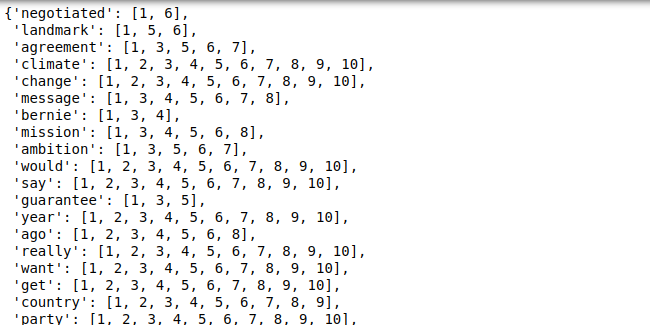

# Postings-List-and-Inverted-Index

## Postings list sample format
This is a sample of a postings list. The postings list can be accessed for each document from the postings_lists_list.pkl file.

Each element is of the format [docID, word position ]. The word position is the position of the word after preprocessing. 

## Inverted Index sample format

## Document ID sample format

The document ID of the csv files to map back.

## Details about files

### utils/process_raw_data.py 
This file is just to combine all the csv files into a single csv and save it somewhere. 

### generate_list_index.py
This file is to generate the postings list and inverted index and save it as pickle files for later use.

### postings_list.pkl
The saved dictionary of the postings list.

### inverted_index.pkl
The saved dictionary of the inverted index.

### postings_lists_list.pkl
The saved list of dictionaries (Use this file).

### inverted_index_new.pkl
The index of word with document ID (Use this file).

### The combined csv file
I have combined all the 480 csv files into a single one and have uploaded it [here](https://drive.google.com/file/d/1f6SX0i5eNJ8LA_WG4gVm3VR30FzG7Vqs/view?usp=sharing). The indexes of these files has been used as the docID for the postings list and inverted index.
